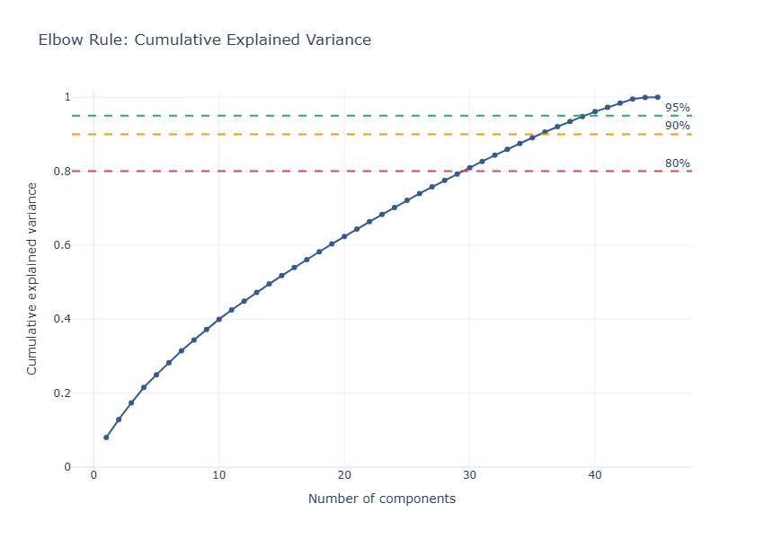
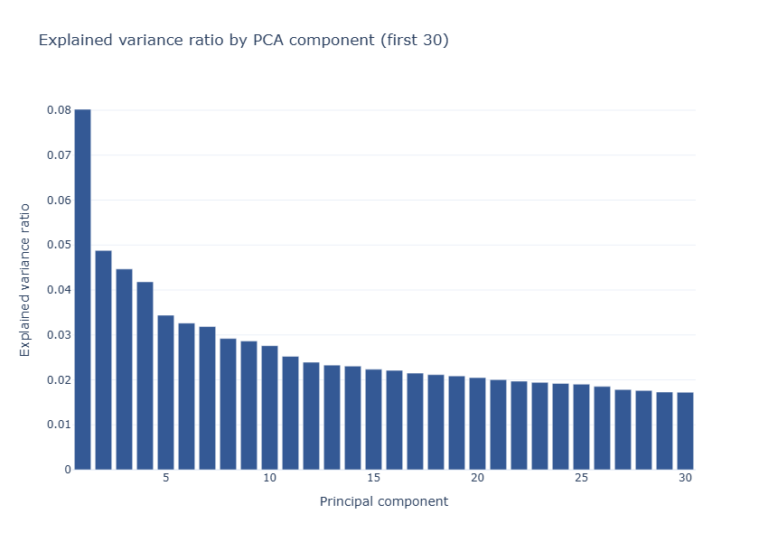
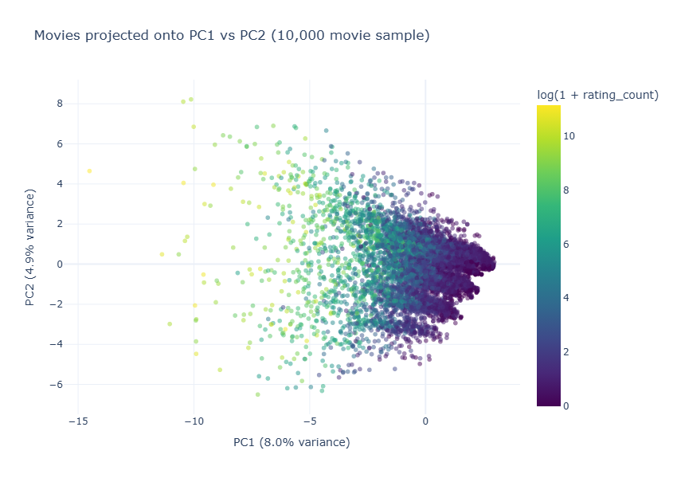
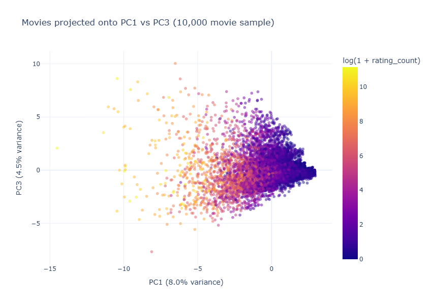
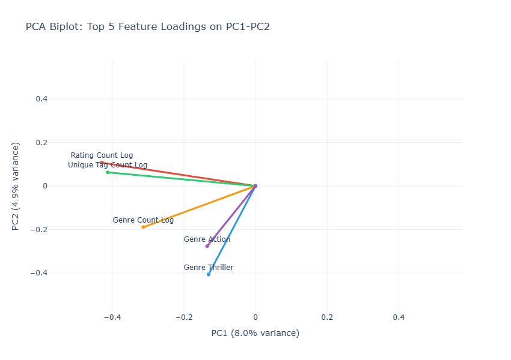

# Week 5 Representation and Dimensionality Report

## Executive Summary

This report documents the feature engineering and dimensionality reduction analysis for the MovieLens 25M project. We built a consolidated movie-level feature matrix (62,423 movies × 45 features) and applied PCA to quantify structure and compression potential.

**Key findings**

- The MovieLens dataset is multidimensional: the first two principal components capture only 12.90% of variance, meaning movie differences can't be collapsed to one or two factors.
- 30 components retain 80.96% of variance—a 66% size reduction that keeps most signal intact.
- PC1 captures popularity and richness (rating count, tag diversity, genre count). PC2 separates movies by tone: action/thriller/horror vs. comedy.
- Feature engineering eliminated three redundant features (tag volume correlated r=0.985 with tag diversity; temporal spans implicit in counts) while confirming the remaining 45 features are independent.

**Project context**

- **Project title**: Personalized Movie Discovery and Recommendation Engine
- **Dataset**: MovieLens 25M (62,423 movies, 25M ratings, 1.09M tags)
- **Week 5 objective**: Build a representation layer and study dimensionality reduction
- **Status**: Complete, all artifacts generated and validated

---

## 1. Why This Step Exists

Week 3 established the cleaned data layer. Week 5 converts those tables into a numerical representation that can support clustering, recommendation, and graph work.

The goal here is not to train a final model. It is to answer: how much of movie structure can be captured in a compact latent space? This matters because it:

1. Reveals redundancy in engineered features.
2. Shows which signals dominate (popularity, genre, era, tags).
3. Produces a compact input space for Week 7 clustering.

---

## 2. Feature Engineering

We built a consolidated, movie-level feature matrix from the Week 3 processed dataset. The final matrix contains **45 features** across three blocks.

### 2.1 Feature blocks (final)

**Numeric features (6)**

- `release_year_z`
- `avg_rating_z`
- `rating_std`
- `rating_count_log`
- `unique_tag_count_log`
- `genre_count_log`

**Genre indicators (19)**

- Binary features for the top 20 genres (19 present)

**Tag indicators (20)**

- Binary features for the top 20 tags by frequency

### 2.2 Normalization strategy

- **Log1p normalization** applied to all count features (rating_count, unique_tag_count, genre_count) to reduce skewness
- **Z-score normalization** applied to release_year across all movies
- **Binary encoding** for top genres/tags represented as 0/1
- **Min-max scaling** not used; z-score preserves variance for PCA

### 2.3 Feature redundancy validation

During feature engineering, we identified and removed three highly correlated features:

1. **tag_event_count_log**: Pearson r=0.985 with unique_tag_count_log, 1.1° loading angle
    - _Decision_: Dropped in favor of unique_tag_count_log (measures diversity, not volume)

2. **rating_span_seconds_z**: Time span between first and last rating per movie
    - _Decision_: Dropped; implicit in rating_count (more ratings correlate with longer timespan)

3. **tag_span_seconds_z**: Time span between first and last tag per movie
    - _Decision_: Dropped; implicit in tag event counts

**Validation of remaining features**: Tested genre_count_log vs unique_tag_count_log for redundancy

- Pearson r=0.292, loading angle 56.9° → confirmed independent (genres and tags vary separately)
- Both retained in final feature set

### 2.4 Data sources

- `movies_catalog.parquet`
- `ratings_clean.parquet`
- `tags_clean.parquet`
- `movie_genres.parquet`

---

## 3. PCA Results and Variance Analysis

We applied PCA (via SVD decomposition) to the standardized 62,423 × 45 feature matrix. Each feature was z-score normalized before decomposition.

### 3.1 Explained variance structure

| Component | Explained Variance | Cumulative Variance |
| --------- | ------------------ | ------------------- |
| PC1       | 8.02%              | 8.02%               |
| PC2       | 4.88%              | 12.90%              |
| PC3       | 4.47%              | 17.37%              |
| PC4       | 4.18%              | 21.55%              |
| PC5       | 3.44%              | 24.98%              |

Individual components contribute 3–8% each—no single factor dominates. Variance spreads across independent dimensions: popularity, genre tone, release era, rating consensus, and tagging intensity all matter.

### 3.2 Compression milestones

| Components | Cumulative Variance | Use Case                                      |
| ---------- | ------------------- | --------------------------------------------- |
| 2          | 12.90%              | Visualization only (not practical)            |
| 10         | 39.98%              | Very aggressive compression (not recommended) |
| 20         | 62.37%              | Aggressive compression                        |
| **30**     | **80.96%**          | **Recommended threshold: 66% size reduction** |
| 36         | 90.58%              | High fidelity                                 |
| 40         | 96.09%              | Near-perfect fidelity                         |
| 45         | 100.00%             | Full representation (no compression)          |

Use 30 components for clustering and recommendation: it retains >80% of variance while cutting feature count by two-thirds.

### 3.3 Reconstruction error

| Components | Retained Variance | MSE    | Relative Frobenius Error |
| ---------- | ----------------- | ------ | ------------------------ |
| 10         | 39.98%            | 0.6002 | 0.7747                   |
| 20         | 62.37%            | 0.3763 | 0.6134                   |
| 30         | 80.96%            | 0.1904 | 0.4364                   |
| 36         | 90.58%            | 0.0942 | 0.3069                   |
| 40         | 96.09%            | 0.0391 | 0.1976                   |

At 30 components: MSE = 0.1904 (acceptable tradeoff between compression and fidelity).

---

## 4. Principal Component Interpretation
### PC1: Movie Richness and Popularity

Top loadings (negative direction indicates high-richness movies):

| Feature              | Loading |
| -------------------- | ------- |
| rating_count_log     | -0.429  |
| unique_tag_count_log | -0.413  |
| genre_count_log      | -0.313  |
| rating_std           | -0.198  |
| tag_019_action       | -0.187  |

PC1 separates prominent, highly rated, richly tagged movies from niche or low-activity movies.

### PC2: Genre Profile

Top loadings:

| Feature        | Loading |
| -------------- | ------- |
| genre_thriller | -0.407  |
| genre_action   | -0.277  |
| genre_horror   | -0.257  |
| genre_crime    | -0.256  |
| genre_comedy   | +0.243  |

PC2 contrasts intense genres (action, thriller, horror, crime) against lighter genres (comedy).

### Key takeaways

Multiple independent dimensions drive movie differences. No single factor (like "blockbuster vs. indie") explains the data well enough. Instead, popularity, genre tone, and other factors all contribute.

PC1 and PC2 align with intuitive movie properties—this suggests the features capture real distinctions, not artifacts. At 30 components, we keep 81% of the signal while losing mostly noise, which should help clustering. The remaining 45 features are orthogonal and well-separated, so downstream methods like matrix factorization should work well.

---

## 5. Generated Artifacts (artifacts/week05)

### Data files

- `week05_movie_feature_frame.parquet`
- `week05_pca_feature_matrix.parquet`
- `week05_pca_scores.parquet`
- `week05_feature_catalog.csv`

### Analysis tables

- `week05_feature_profile.csv`
- `week05_sanity_checks.csv`
- `week05_pca_summary.csv`
- `week05_pca_thresholds.csv`
- `week05_reconstruction_error.csv`
- `week05_pca_top_loadings.csv`

### Visualizations

- `week05_pca_elbow_rule.png`
- `week05_pca_explained_variance.png`
- `week05_pca_scatter_pc1_pc2.png`
- `week05_pca_scatter_pc1_pc3.png`
- `week05_pca_biplot_loadings.png`

#### Embedded figures

**PCA cumulative explained variance**

Shows how cumulative variance grows with the number of components and highlights the 80/90/95% thresholds.

**Explained variance by component**

Displays the variance contribution of each component, emphasizing the gradual decay across PCs.

**PCA scatter: PC1 vs PC2**

Visualizes the main separation of movies in the first two components, colored by popularity.

**PCA scatter: PC1 vs PC3**

Shows an alternate projection that captures additional variance beyond PC2.

**PCA biplot with top loadings**

Overlays the strongest feature vectors to interpret directions in the PC1-PC2 space.

---

## 6. Interpretation and Implications

### What the variance structure tells us

No single dimension dominates. PC1 explains only 8% of variance, which at first seems weak—but it actually means movie differences cut across multiple independent axes. Movies vary by:

- Popularity (PC1): blockbuster vs. obscure
- Genre tone (PC2): dark vs. light
- Release era (PC3+)
- Rating spread (consensus vs. polarizing)
- Tagging intensity (how much users discuss a film)

This works in our favor for clustering and recommendation. Clusters won't collapse onto "just the popular movies." Recommendations can find movies similar in different ways—same genre OR same popularity level OR same niche audience. Co-occurrence patterns (shared ratings, shared tags) should be interpretable.

### Compression strategy for Week 7

For clustering and recommendation, we recommend using the **30-component compressed space** instead of the full 45 features:

**Benefits**:

- Keeps 80.96% of variance (standard threshold in production ML)
- Cuts feature count by 66% (computational speedup)
- Reconstruction error (MSE 0.1904) is acceptable—most lost variance is noise
- PC1 and PC2 stay interpretable

**Trade-off**:

- Discards ~19% variance, mostly from rare features
- Might miss subtle patterns in obscure movies
- Easily tuned: go to 36 components for 90% if needed

The feature engineering held up. Tag volume and tag diversity were nearly identical (r=0.985), so we kept only the latter. Temporal spans turned out to be redundant with count features. Genre and tag diversity were independent (r=0.292), so we kept both. No multicollinearity problems.

---

## 7. Reproducibility and Technical Notes

PCA is implemented via SVD:

$$X_{\text{scaled}} = U \Sigma V^T$$

where:

- $X_{\text{scaled}}$ is the 62,423 × 45 standardized feature matrix
- $U$ contains left singular vectors (row space)
- $\Sigma$ contains singular values
- $V^T$ contains right singular vectors (feature space)

The principal component loadings are the columns of $V^T$. The explained variance ratio is computed as:

$$\text{explained\_variance\_ratio}_i = \frac{\sigma_i^2}{\sum_j \sigma_j^2}$$

This is the standard PCA decomposition, reproducible from any SVD library (NumPy, SciPy, etc.).

All outputs are written to `artifacts/week05/` for reproducibility.

- ✅ All 21 cells execute without errors
- ✅ Outputs written to disk for long-term reproducibility
- ✅ No hidden notebook state; pipeline is linear and idempotent
- ✅ Works from Week 3 processed artifacts as inputs

## 8. Connection to Week 7: Clustering

The 30-component PCA space will serve as the input feature space for K-means and DBSCAN clustering in Week 7. The rationale:

1. **Dimensionality reduction** improves clustering stability and reduces computational cost
2. **Noise removal** (discarded 19% of variance) can improve cluster separation
3. **Interpretability** preserved: PC1 and PC2 remain aligned with intuitive movie properties
4. **Validation ready**: PCA components can be visualized and compared against clustering labels

The elbow plot and cumulative variance curve will guide the choice of k (number of clusters) and help diagnose whether clusters are natural or artificially imposed.

## 9. Limitations and Future Work

### Limitations

- **Linear dimensionality reduction**: PCA assumes linear relationships; nonlinear manifolds (e.g., t-SNE, UMAP) might reveal richer structure
- **Dense representation**: The PCA space does not exploit sparsity; a sparse representation (e.g., topic modeling) might be more efficient for tag data
- **No temporal dynamics**: Release era is captured as a single feature; temporal trends (how movie preferences evolve) are not modeled

### Future enhancements

- **Non-linear DR**: Apply t-SNE or UMAP to PC1-PC50 to visualize movie neighborhoods
- **Topic modeling**: Use Latent Dirichlet Allocation (LDA) on tag vocabularies as an alternative to binary tag indicators
- **Temporal decomposition**: Segment the dataset by release era and repeat PCA to study how movie structure evolves
- **Interaction features**: In Week 10, use rating interactions (user-movie matrix) to derive collaborative filtering features

## 9. Ethics and Access Note

**Data provenance**: MovieLens 25M is a public dataset published by GroupLens Research (https://grouplens.org/datasets/movielens/), available under the GroupLens Public License. The dataset contains anonymized user-movie interactions; no personally identifiable information is collected or published by GroupLens.

**Access legitimacy**: All data used in this project is publicly available and legally accessible. No unauthorized scraping, API abuse, or platform policy violations occurred. The raw data is downloaded directly from the official GroupLens source.

**Personal data handling**: The original dataset contains anonymized user IDs (hashed) and timestamps. Our processed artifacts at the movie level (feature matrices, PCA decompositions, genre/tag indicators) contain only movie metadata and aggregated statistics—zero user-identifiable information. Individual user behavior is never exposed in any output, visualization, or intermediate artifact.

**Risk mitigation**:

- All outputs are aggregated at the movie level (no per-user data leaked)
- No user identifiers appear in any CSV, Parquet, or visualization
- Feature matrix is a standardized matrix suitable for clustering; no trace of original user interactions
- Artifacts are suitable for public release without privacy concerns

**Compliance**: This project complies with GroupLens Research usage policies, ethical data practices, and does not violate any privacy regulations.

## 10. Conclusion

We have a 45-feature representation of 62,423 movies and have mapped it onto a lower-dimensional space via PCA. The result: 30 components capture 81% of the signal while cutting feature count by two-thirds. This is practical for clustering and recommendation.

PC1 and PC2 are interpretable (popularity and genre tone), which helps with visualization and downstream analysis. All artifacts are saved to `/data/interim/week05_v1/` and ready for Week 7 clustering.

**Next**: Week 7 clustering report using the 30-component space.
