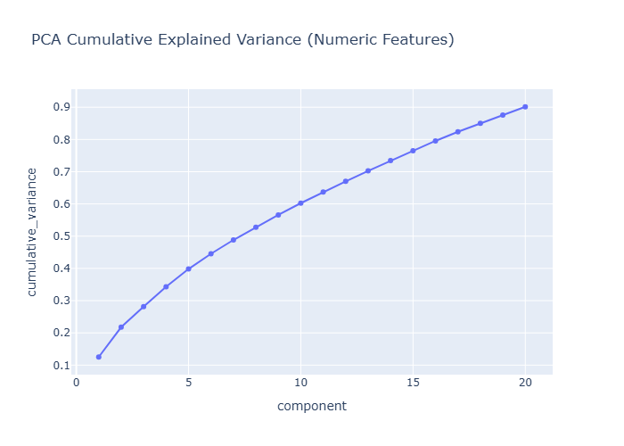
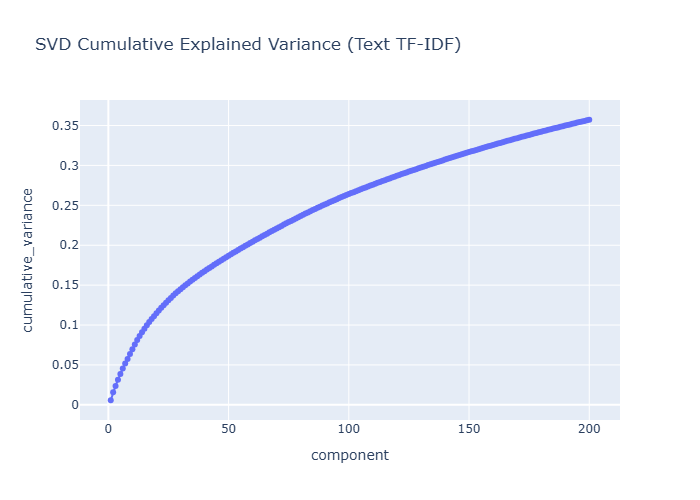
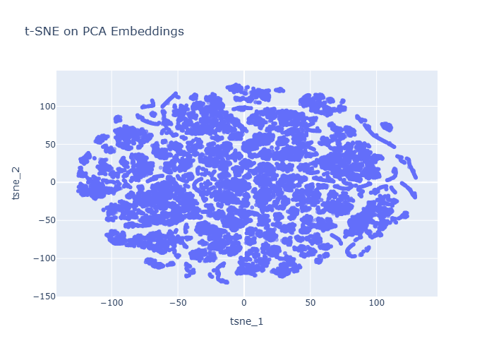

# Week 5 - Representation and Dimensionality Report

## Executive Summary

This report documents the Week 5 deliverables for representation and dimensionality reduction. The objective is to move from cleaned MovieLens tables to meaningful feature matrices, then validate structure and redundancy through PCA/SVD and supporting visualizations.

- **Project title**: Personalized Movie Discovery and Recommendation Engine (MovieLens 25M)
- **Course**: Semester Project: Domain Discovery, Recommendation, and Graph Intelligence
- **Milestone objective**: Build reproducible feature representations and dimensionality reduction artifacts
- **Report date**: April 2026
- **Status**: Feature matrices, dimensionality reduction, comparison table, and visualizations completed

---

## 1. Feature Matrices

Two feature matrices are built at the movie level.

### 1.1 Numeric and Categorical Matrix

**Description**

This matrix combines rating aggregates, time-span coverage, and one-hot genres. It is intended to capture overall popularity, rating distribution, and catalog category signals in a compact numeric form.

**Core columns**

- Ratings: `rating_count`, `rating_mean`, `rating_std`, `rating_min`, `rating_max`, `rating_median`
- Temporal: `rating_first_ts`, `rating_last_ts`, `rating_span_days`
- Categorical: one-hot genre columns derived from `movie_genres`
- Tag activity: `tag_count` (count of distinct tags per movie)

**Output**

- `data/processed/week05/movie_numeric_features.parquet`

### 1.2 Text Matrix (TF-IDF)

**Description**

This matrix represents the semantic profile of each movie using aggregated tags and titles. We concatenate `title` and the unique tag list, then apply TF-IDF with English stop-word removal.

**TF-IDF configuration**

- `max_features = 5000`
- `min_df = 2`
- `stop_words = "english"`

**Outputs**

- `data/processed/week05/movie_text_tfidf.npz`
- `data/processed/week05/movie_text_tfidf_vocab.json`

### 1.3 Data Sources

- `data/processed/week03_v1/movies_catalog.parquet`
- `data/processed/week03_v1/movie_genres.parquet`
- `data/processed/week03_v1/ratings_clean.parquet`
- `data/processed/week03_v1/tags_clean.parquet`

---

## 2. Dimensionality Reduction

We apply two methods, aligned to the two feature spaces:

### 2.1 PCA (Numeric Matrix)

- Input: standardized numeric matrix
- Target variance: 90% cumulative variance
- Output: `data/processed/week05/movie_pca_embeddings.parquet`

**Artifacts**

- `artifacts/week05/pca_variance.csv`

### 2.2 Truncated SVD (Text TF-IDF)

- Input: sparse TF-IDF matrix
- Components: 200
- Output: `data/processed/week05/movie_svd_embeddings.parquet`

**Artifacts**

- `artifacts/week05/svd_variance.csv`

### 2.3 t-SNE (Visualization)

- Input: PCA embeddings
- Output: `artifacts/week05/pca_tsne.parquet`

---

## 3. Comparison Table

Summary metrics are stored at `artifacts/week05/comparison_table.csv`.

| Method | Components | Cumulative Variance | Reconstruction Error |
| --- | --- | --- | --- |
| PCA | 20 | 0.9012 | 0.0988 |
| TruncatedSVD | 200 | 0.3572 | 0.6373 |

---

## 4. Visualization Set

Generated with Plotly and saved as HTML and PNG:

1. PCA cumulative explained variance: `artifacts/week05/pca_cumulative_variance.html`
2. SVD cumulative explained variance: `artifacts/week05/svd_cumulative_variance.html`
3. t-SNE scatter of PCA embeddings: `artifacts/week05/tsne_scatter.html`







---

## 5. Technical Interpretation

1. **Numeric features are compact**: PCA captures 90.12% of numeric-feature variance with 20 components, indicating strong redundancy among rating statistics and genre indicators.
2. **Text features are diffuse**: Truncated SVD reaches only 35.72% cumulative variance at 200 components, reflecting higher semantic diversity across tags and titles.
3. **Representation trade-off**: Numeric signals compress well, while text signals preserve more long-tail variation; downstream models should treat these spaces differently.

---

## Reproducibility

To rebuild all Week 5 outputs:

```bash
python3 scripts/build_week05_pipeline.py
```

To rebuild the PDF report (requires Pandoc and a LaTeX engine):

```bash
pandoc reports/week05/week05_representation_report_v1.md -o reports/week05/week05_representation_report_v1.pdf
```
