# Guia de exposicion Week 10: Sistema de recomendacion de peliculas

Este documento explica la Week 10 de forma sencilla, pensando en alguien que recien esta entrando al campo de Data. La idea es que puedas exponer el proyecto, entender que se hizo tecnicamente y responder preguntas sin memorizar frases vacias.

---

## 1. Resumen en una frase

En la Week 10 se construyo y evaluo un sistema que, dada una pelicula de entrada, recomienda otras peliculas similares o relevantes usando popularidad, similitud de contenido, clusters y comportamiento de usuarios.

En simple:

> Si el usuario parte de una pelicula como *Toy Story*, el sistema intenta ordenar otras peliculas que tendrian sentido como recomendacion.

---

## 2. Que tipo de problema resolvimos

Este proyecto puede describirse de cuatro formas relacionadas:

| Concepto | Como aparece en el proyecto | Explicacion simple |
|---|---|---|
| Recomendacion | El sistema sugiere peliculas | "Si viste esta, mira estas otras" |
| Ranking | Ordena peliculas de mejor a peor | No basta con elegir peliculas; importa el orden |
| Segmentacion alimentando ranking | Usa clusters de Week 7 para limitar candidatos | Primero agrupa peliculas parecidas, luego rankea dentro del grupo |
| Prediccion | En LOO intenta adivinar una pelicula real que un usuario califico | Evalua si el sistema predice comportamiento real |

La identidad principal del proyecto es:

> Un sistema de recomendacion item-to-item, implementado como un problema de ranking.

"Item-to-item" significa que parte de una pelicula y recomienda otras peliculas, no parte directamente de un perfil de usuario.

---

## 3. De donde vienen los datos

El proyecto usa MovieLens 25M, un dataset publico con ratings de peliculas.

En semanas anteriores ya se habia preparado la base:

| Semana | Que aporto | Para que sirve en Week 10 |
|---|---|---|
| Week 3 | Limpieza de ratings y catalogo de peliculas | Popularidad, SVD y metadata |
| Week 5 | Matriz de features de peliculas | Base para embeddings |
| Week 7 | Autoencoder y clusters K-Means | Similitud de contenido y recomendacion por cluster |
| Week 10 | Recomendadores y evaluacion | Sistemas finales y comparacion |

El identificador que une casi todo es `movieId`.

---

## 4. Pipeline general

El flujo completo se puede entender asi:

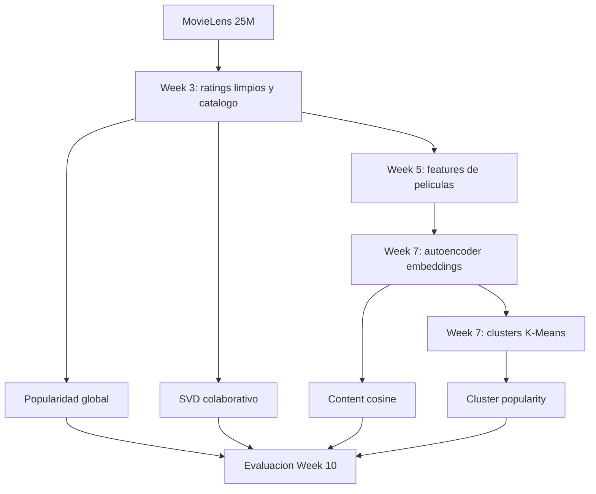

Si no se renderiza el diagrama Mermaid en tu visor, quedate con esta idea:

1. Partimos de ratings y catalogo.
2. Construimos distintos sistemas de recomendacion.
3. Cada sistema genera un top-20 de peliculas recomendadas.
4. Comparamos esos tops usando metricas offline.

---

## 5. Los cuatro sistemas evaluados

### 5.1 `popularity_global`

Recomienda peliculas populares para todos.

Ejemplo mental:

> "No se nada del usuario ni de la pelicula, asi que recomiendo peliculas muy vistas o muy calificadas."

Ventaja:

- Es simple.
- Funciona razonablemente bien como baseline.

Desventaja:

- Tiende a recomendar siempre lo mainstream.
- Falla con generos de nicho como Documentary, Western, Film-Noir o Musical.

Grafico relacionado:

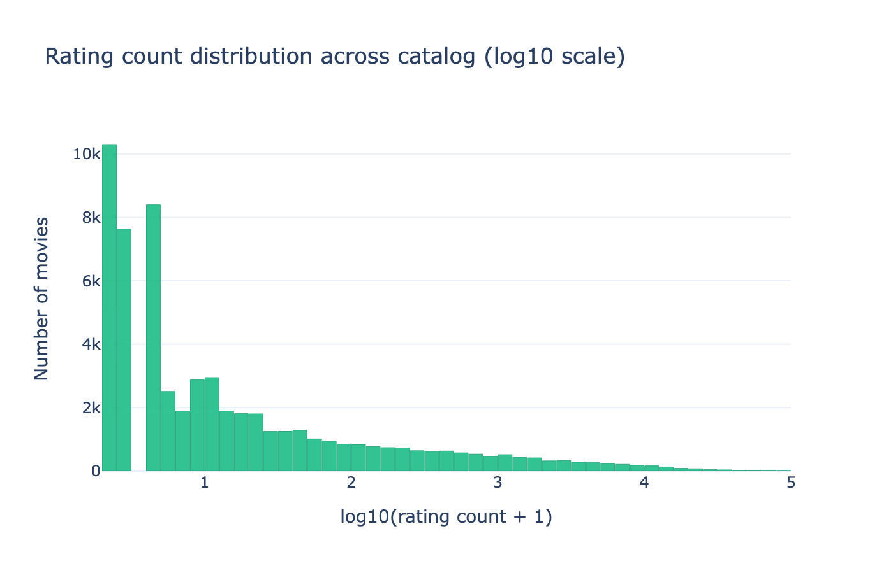

Como leerlo:

- La mayoria de peliculas tiene pocos ratings.
- Un grupo pequeno concentra muchisima atencion.
- Esto se llama long tail: muchas peliculas poco vistas y pocas peliculas extremadamente populares.

---

### 5.2 `cluster_popularity`

Es un sistema hibrido.

Primero usa el cluster de la pelicula de entrada, generado en Week 7. Luego recomienda peliculas populares dentro de ese mismo cluster.

Ejemplo:

> Si la pelicula de entrada pertenece a un cluster de documentales, el sistema busca peliculas populares dentro de ese cluster, no en todo el catalogo.

Ventaja:

- Usa segmentacion para evitar recomendaciones demasiado genericas.
- En K=20 fue mas preciso que la popularidad global.

Desventaja:

- Si el cluster mezcla varios generos, puede recomendar la mayoria del cluster y fallar para peliculas minoritarias.

Grafico relacionado:

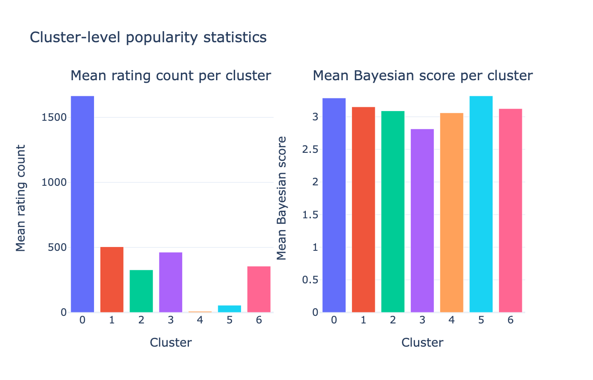

Como leerlo:

- Cada cluster tiene distinto volumen de peliculas y ratings.
- Algunos clusters son muy mainstream.
- Otros clusters tienen peliculas de nicho con pocos ratings.

---

### 5.3 `content_cosine`

Recomienda peliculas parecidas usando embeddings.

Un embedding es una representacion numerica de una pelicula. En vez de ver una pelicula como texto o generos, la representamos como un vector de numeros.

Ejemplo simplificado:

```text
Toy Story -> [0.82, 0.15, -0.33, ...]
Finding Nemo -> [0.79, 0.18, -0.29, ...]
The Godfather -> [-0.12, 0.88, 0.51, ...]
```

Si dos vectores apuntan en direccion parecida, se consideran similares.

La similitud se midio con cosine similarity.

Ventaja:

- Muy fuerte para encontrar peliculas parecidas por contenido.
- En la evaluacion por genero fue el mejor sistema.

Desventaja:

- No necesariamente predice lo que un usuario real vera despues.
- Puede ser demasiado "literal": recomienda por parecido de contenido, no por comportamiento.

Grafico relacionado:

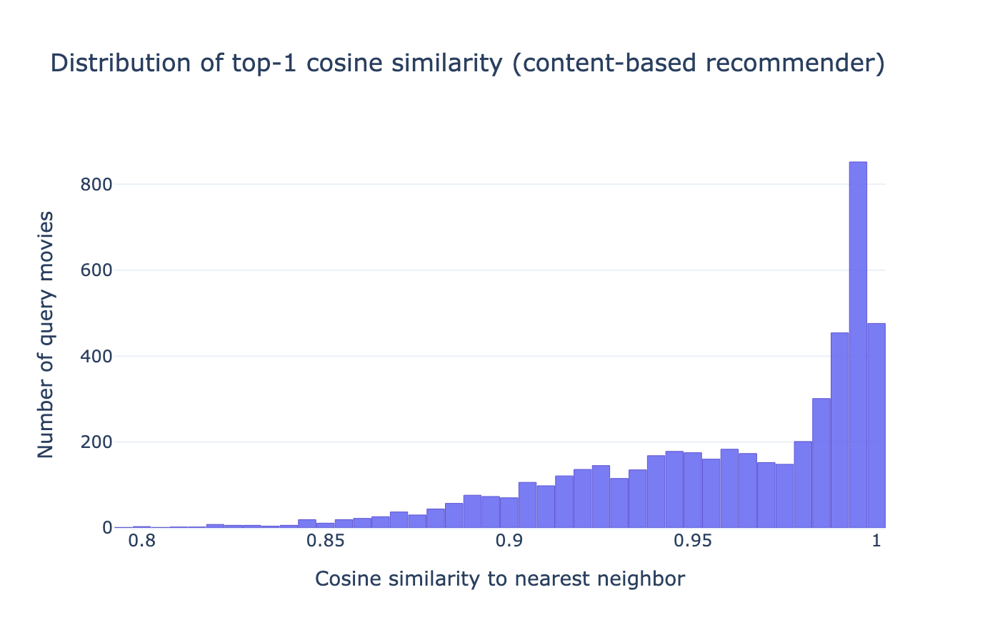

Como leerlo:

- Muchas peliculas tienen vecinos muy similares.
- Eso indica que el espacio de embeddings de Week 7 quedo bien estructurado.

---

### 5.4 `svd_collaborative`

Usa collaborative filtering.

La idea no es mirar solo las caracteristicas de la pelicula, sino patrones de usuarios.

Ejemplo:

> Si muchos usuarios que calificaron A tambien calificaron B, entonces A y B pueden estar relacionadas aunque no compartan exactamente el mismo genero.

El modelo usado fue Truncated SVD sobre una matriz usuario-pelicula.

La matriz se puede imaginar asi:

| Usuario | Pelicula A | Pelicula B | Pelicula C |
|---|---:|---:|---:|
| U1 | 5 | 4 | ? |
| U2 | 5 | ? | 2 |
| U3 | ? | 4 | 1 |

El SVD busca patrones latentes. Es decir, factores ocultos que explican por que ciertas peliculas se consumen de forma parecida.

Ventaja:

- Captura comportamiento real de usuarios.
- Fue el mejor sistema en la evaluacion LOO.

Desventaja:

- Necesita suficientes ratings.
- Solo pudo trabajar con 13,176 peliculas filtradas, no con todo el catalogo.

Graficos relacionados:

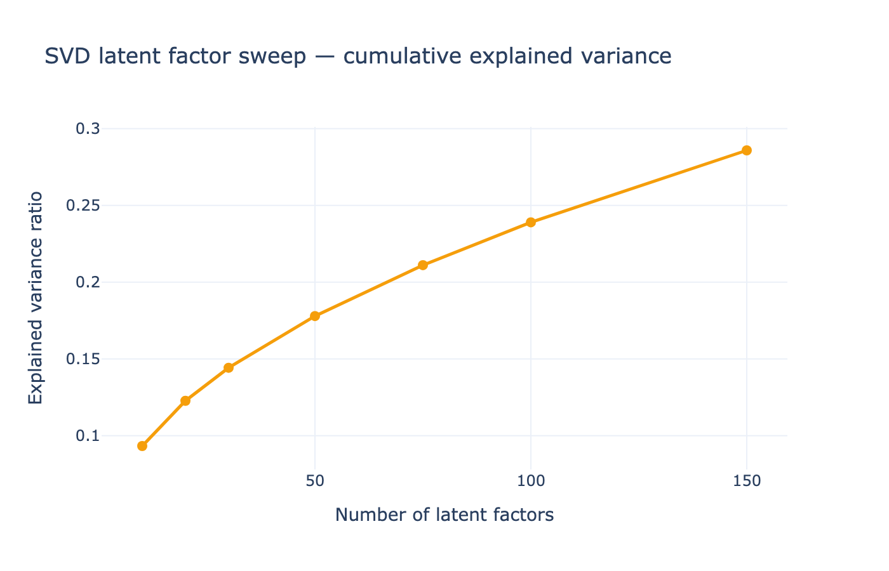

Como leerlo:

- Se probaron distintos numeros de componentes.
- Se eligio `k=50` porque daba buen balance entre informacion capturada y complejidad.

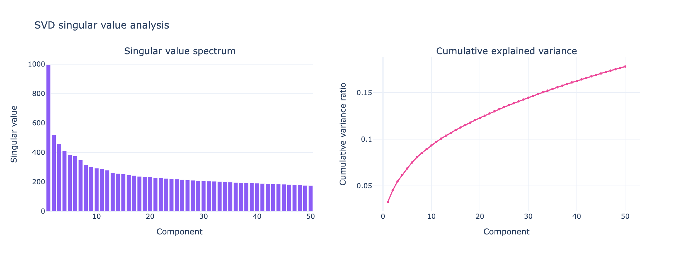

Como leerlo:

- La caida de valores singulares indica que hay estructura latente en la matriz.
- Eso justifica usar reduccion dimensional.

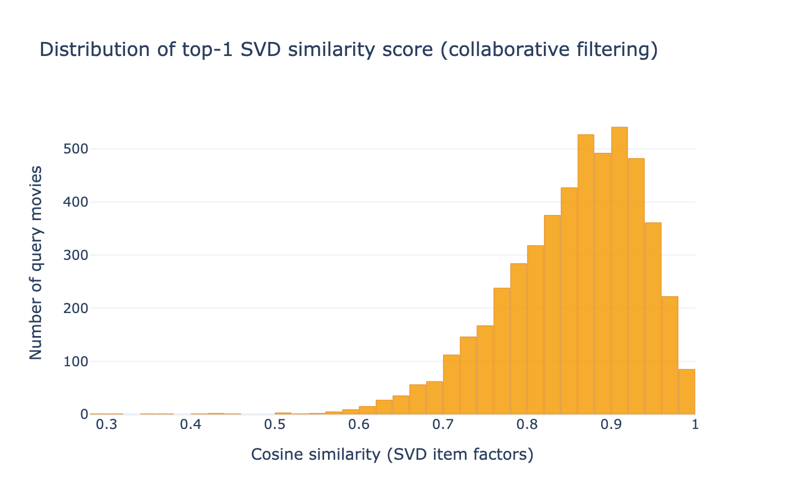

Como leerlo:

- Muestra que tan fuertes son las similitudes encontradas por SVD.

---

## 6. Que significa evaluar offline

Evaluar offline significa probar el sistema con datos historicos, no con usuarios reales en produccion.

En Week 10 hubo dos evaluaciones:

| Evaluacion | Que pregunta responde | Ground truth |
|---|---|---|
| Genero compartido | Las recomendaciones se parecen a la pelicula de entrada? | Comparte al menos un genero |
| Leave-One-Out | El sistema predice una pelicula real del usuario? | Ultima pelicula calificada por el usuario |

Ambas sirven, pero miden cosas diferentes.

---

## 7. Evaluacion por genero

La regla fue:

> Una recomendacion es relevante si comparte al menos un genero con la pelicula de entrada.

Ejemplo:

| Pelicula base | Generos | Recomendacion | Es relevante? |
|---|---|---|---|
| Toy Story | Animation, Children, Comedy | Finding Nemo | Si |
| Toy Story | Animation, Children, Comedy | The Godfather | No |

Se evaluaron:

- 4,994 peliculas de consulta.
- Top-20 recomendaciones por sistema.
- Universo de 59,047 peliculas con ratings y generos.

---

## 8. Metricas explicadas facil

### Precision@K

Pregunta:

> De las K recomendaciones que di, cuantas fueron relevantes?

Ejemplo:

Si `K=10` y 8 recomendaciones comparten genero:

```text
Precision@10 = 8 / 10 = 0.8
```

Es una metrica muy intuitiva para ranking.

---

### Hit Rate@K

Pregunta:

> Al menos una de mis K recomendaciones fue relevante?

Si hay al menos una recomendacion correcta, vale 1 para esa consulta. Si no, vale 0.

Luego se promedia sobre muchas consultas.

---

### NDCG@K

Pregunta:

> Mis recomendaciones relevantes aparecen arriba del ranking?

No es lo mismo recomendar algo relevante en la posicion 1 que en la posicion 10.

NDCG premia mas los aciertos al inicio de la lista.

Interpretacion rapida:

- Cerca de 1.0: ranking muy bueno.
- Cerca de 0.0: ranking malo.

---

### Recall@K

Pregunta:

> De todo lo relevante que existia, cuanto logre recuperar?

En este proyecto el recall corregido queda muy pequeno porque hay muchisimas peliculas que comparten al menos un genero.

Promedio:

```text
22,301 peliculas relevantes por query
```

Pero solo recomendamos 20.

Entonces incluso un sistema muy bueno no puede tener un recall alto:

```text
20 / 22,301 = aproximadamente 0.0009
```

Por eso, en esta evaluacion, Precision y NDCG son mas informativas que Recall.

---

## 9. Correccion importante de metricas

En la evaluacion original habia dos problemas:

1. `Recall@K` usaba como denominador el propio top-20 del sistema, no todo el catalogo relevante.
2. `NDCG@K` usaba un ideal demasiado dependiente de lo que el sistema habia recuperado.

Eso inflaba los resultados.

Se creo este script para corregirlo:

```text
scripts/build_week10_eval_corrected.py
```

El script:

- Reproduce las metricas viejas para confirmar que parte del mismo calculo.
- Corrige Recall usando el catalogo completo.
- Corrige NDCG usando un ranking ideal justo.
- Agrega `cluster_popularity` a la tabla principal.
- Genera tablas reproducibles.

Archivos generados:

```text
artifacts/week10/week10_genre_eval_corrected.csv
artifacts/week10/week10_data_alignment.csv
```

Resultado de validacion:

```text
max abs diff contra la evaluacion original = 0.0002
```

Eso significa que el script reproduce casi exactamente el comportamiento original antes de aplicar la correccion.

---

## 10. Resultados de evaluacion por genero

Tabla corregida resumida en K=10:

| Sistema | Precision@10 | Catalog Recall@10 | NDCG@10 corregido | Hit Rate@10 |
|---|---:|---:|---:|---:|
| `popularity_global` | 0.5554 | 0.000263 | 0.5852 | 0.9720 |
| `cluster_popularity` | 0.5449 | 0.000297 | 0.5590 | 0.8214 |
| `content_cosine` | 0.9775 | 0.000588 | 0.9797 | 0.9990 |
| `svd_collaborative` | 0.8603 | 0.000485 | 0.8715 | 0.9958 |

Conclusion de esta evaluacion:

> `content_cosine` fue el mejor sistema para encontrar peliculas que comparten genero con la pelicula base.

Grafico relacionado:

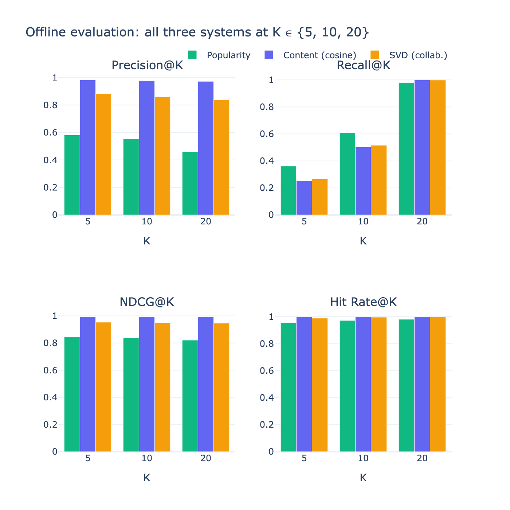

Nota importante:

Este grafico viene de la corrida original, por eso algunas metricas mostradas ahi son legacy. Para la exposicion, usa la tabla corregida como fuente principal.

Otro grafico relacionado:

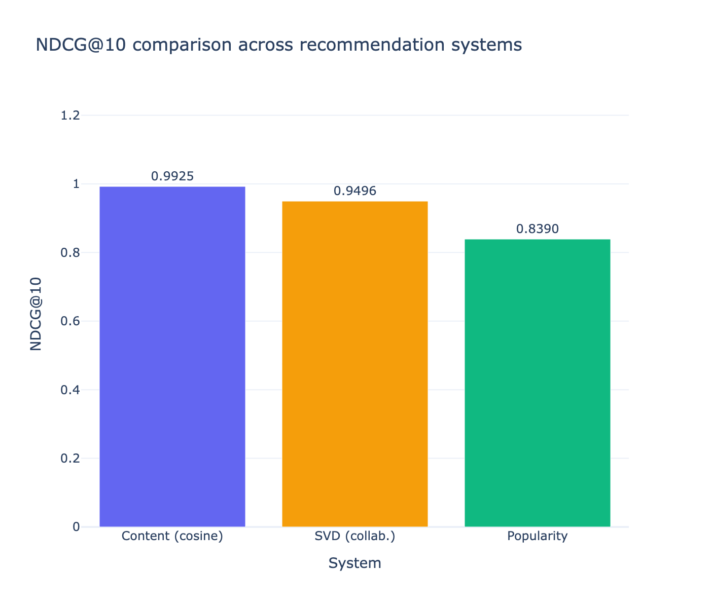

Nota:

Tambien este grafico corresponde a la corrida original. Sirve visualmente para explicar la comparacion, pero debes mencionar que la tabla corregida es la version final.

Distribucion por query:

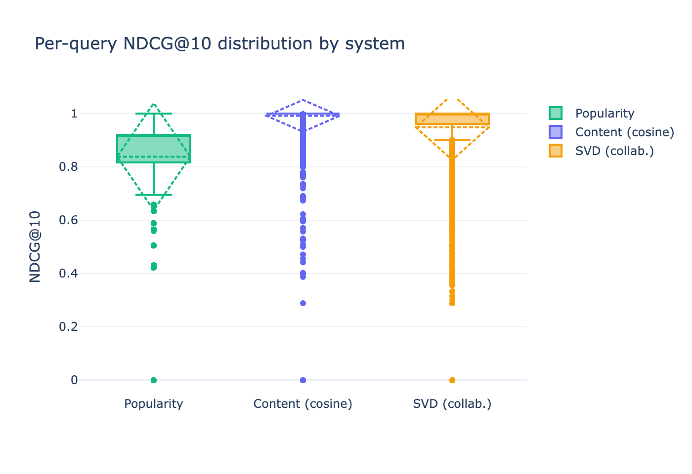

Como leerlo:

- Muestra la variabilidad por pelicula de consulta.
- `content_cosine` no solo tiene alto promedio, tambien es estable.

---

## 11. Evaluacion Leave-One-Out

La evaluacion LOO busca responder otra pregunta:

> Si oculto la ultima pelicula que un usuario califico, puede el sistema recomendarla?

Proceso:

1. Se toman usuarios con suficientes ratings.
2. Para cada usuario, se oculta su ultima pelicula.
3. El sistema recomienda peliculas usando el historial restante.
4. Se verifica si la pelicula oculta aparece en el top-K.

Esta evaluacion es mas cercana a comportamiento real de usuarios.

Resultados en K=10:

| Sistema | Hit Rate@10 | NDCG@10 |
|---|---:|---:|
| `popularity_global` | 0.0465 | 0.0238 |
| `content_cosine` | 0.0368 | 0.0187 |
| `svd_collaborative` | 0.0795 | 0.0432 |

Conclusion:

> En prediccion de comportamiento real, `svd_collaborative` fue el mejor sistema.

Grafico:

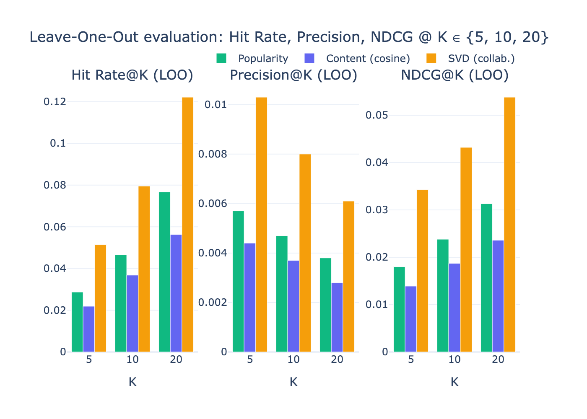

Como leerlo:

- SVD supera a popularidad y contenido.
- Esto muestra que los patrones de usuarios contienen informacion que los generos no capturan.

---

## 12. Por que cambia el ganador segun la evaluacion

Esta es una idea clave para explicar bien.

| Evaluacion | Ganador | Por que |
|---|---|---|
| Genero compartido | `content_cosine` | Los embeddings agrupan peliculas parecidas por contenido/genero |
| LOO usuario | `svd_collaborative` | SVD aprende patrones reales de usuarios |

No es contradiccion.

Son preguntas distintas:

- Genero: "Se parecen las peliculas?"
- LOO: "Un usuario real consumiria esta pelicula?"

Una pelicula puede ser parecida por genero, pero no necesariamente ser la siguiente pelicula que un usuario vera.

---

## 13. Error analysis

El analisis de errores revisa donde los sistemas funcionan muy bien y donde fallan.

### Casos fuertes

`content_cosine` funciona bien con peliculas donde el contenido es claro:

- Animation
- Children
- Comedy
- Romance

Ejemplo:

> Una pelicula como *Toy Story* tiene vecinos naturales en el espacio de embeddings.

`svd_collaborative` funciona bien cuando hay patrones fuertes de usuarios:

- Action
- Adventure
- Thriller
- Family films

### Casos de falla

`popularity_global` falla en generos de nicho:

- Documentary
- Western
- Film-Noir
- Musical

Porque recomienda lo popular global, no lo relevante para el genero.

`content_cosine` puede fallar cuando:

- La pelicula mezcla generos raros.
- El embedding la ubica cerca de peliculas no tan relevantes.

`svd_collaborative` puede fallar cuando:

- La pelicula tiene pocos ratings.
- El patron de usuarios es ruidoso.
- El genero esta poco representado en la matriz filtrada.

---

## 14. Que aporto el sistema hibrido `cluster_popularity`

Este sistema usa:

```text
Cluster de Week 7 + ranking de popularidad
```

La pregunta era:

> Sirven los clusters para mejorar recomendaciones?

Respuesta:

Si, parcialmente.

Hallazgo:

- A K=20, `cluster_popularity` fue mas preciso que `popularity_global`.
- `cluster_popularity`: Precision@20 = 0.5784
- `popularity_global`: Precision@20 = 0.4595

Interpretacion:

> Restringir la recomendacion al cluster puede evitar recomendaciones demasiado genericas.

Pero tambien puede fallar:

> Si una pelicula es minoritaria dentro de su cluster, el sistema puede recomendar peliculas del genero dominante del cluster.

---

## 15. Data alignment del hibrido

Para decir que un sistema es hibrido, hay que demostrar que los datos realmente se conectan.

Tabla resumida:

| Capa | Peliculas | Cobertura |
|---|---:|---:|
| Catalogo original | 62,423 | 100.00% |
| Embeddings autoencoder | 62,423 | 100.00% |
| Clusters K-Means | 62,423 | 100.00% |
| Universo evaluado con ratings/generos | 59,047 | 94.59% |
| Ranking cluster popularity | 59,047 | 94.59% |
| Factores SVD | 13,176 | 21.11% |
| Query set inicial | 5,000 | 8.01% |
| Queries evaluadas | 4,994 | 8.00% |

Por que bajan los numeros:

- De 62,423 a 59,047: se excluyen peliculas sin ratings.
- De 59,047 a 13,176: SVD filtra peliculas con pocos ratings.
- De 5,000 a 4,994: se intersectan queries de content y SVD, y se exige que tengan genero.

---

## 16. Que debes decir en la exposicion

Una forma clara de explicar el proyecto:

> En Week 10 construimos un sistema de recomendacion item-to-item para MovieLens. Comparamos cuatro enfoques: popularidad global, popularidad por cluster, similitud de contenido con embeddings y SVD colaborativo. Evaluamos con dos protocolos: uno basado en genero compartido y otro Leave-One-Out con historiales de usuario. El modelo de contenido gano cuando medimos similitud por genero, pero SVD gano cuando medimos capacidad predictiva sobre usuarios reales. Tambien corregimos metricas infladas de Recall y NDCG para que la evaluacion fuera mas justa y reproducible.

---

## 17. Preguntas tecnicas probables y respuestas

### Que es un sistema de recomendacion item-to-item?

Es un sistema que parte de un item, en este caso una pelicula, y recomienda otros items similares o relevantes.

Ejemplo:

> Dada *The Matrix*, recomienda peliculas parecidas o relacionadas.

---

### Por que no es principalmente user-to-item?

Porque el input principal del sistema evaluado por genero es una pelicula de consulta, no un usuario.

En LOO si usamos historiales de usuario para evaluar prediccion, pero el objetivo principal sigue siendo ranking de peliculas.

---

### Que es un baseline?

Es un modelo simple que usamos como punto de comparacion.

Si un modelo avanzado no supera al baseline, probablemente no vale la pena.

En este proyecto:

- `popularity_global` es baseline simple.
- `content_cosine` tambien funciona como baseline fuerte de contenido.
- `svd_collaborative` es el sistema avanzado.

---

### Por que usar popularidad si es tan simple?

Porque en recomendadores la popularidad suele ser dificil de vencer.

Muchas veces recomendar lo mas popular ya da resultados razonables.

Sirve como piso minimo.

---

### Que es cosine similarity?

Es una medida para comparar la direccion de dos vectores.

Si dos peliculas tienen embeddings parecidos, su cosine similarity sera alta.

No mide distancia exacta, sino si apuntan en direccion similar.

---

### Que es un embedding?

Es una representacion numerica compacta de un objeto.

En este proyecto, una pelicula se transforma en un vector de 13 numeros aprendido por un autoencoder.

La gracia es que peliculas parecidas quedan cerca en ese espacio.

---

### Que es SVD?

SVD es una tecnica de factorizacion matricial.

En recomendadores, permite descubrir factores latentes en una matriz usuario-pelicula.

Ejemplo de factor latente:

- gusto por ciencia ficcion
- gusto por peliculas familiares
- gusto por clasicos

Estos factores no estan escritos explicitamente, el modelo los aprende a partir de patrones de ratings.

---

### Por que SVD solo usa 13,176 peliculas?

Porque se filtraron peliculas con pocos ratings.

Si una pelicula tiene muy pocas calificaciones, su representacion colaborativa puede ser muy ruidosa.

El filtro mejora calidad, pero reduce cobertura.

---

### Que es K en Precision@K o NDCG@K?

K es el numero de recomendaciones que miramos.

Ejemplo:

- Precision@5 mira las primeras 5.
- Precision@10 mira las primeras 10.
- Precision@20 mira las primeras 20.

---

### Por que corregimos Recall?

Porque el recall original usaba un denominador incorrecto: solo contaba relevantes dentro del pool del propio sistema.

Eso hacia que el sistema pareciera recuperar casi todo, cuando en realidad el universo relevante completo era muchisimo mas grande.

---

### Por que el Recall corregido es tan pequeno?

Porque hay miles de peliculas que comparten al menos un genero con cada query.

Si hay aproximadamente 22,301 relevantes y solo recomiendas 20, el recall maximo promedio es muy bajo.

Eso no significa que el sistema sea malo; significa que Recall no es la metrica mas informativa en esta configuracion.

---

### Entonces que metrica debo defender mas?

Para la evaluacion por genero:

- Precision@K
- NDCG@K

Para la evaluacion LOO:

- Hit Rate@K
- NDCG@K

---

### Por que `content_cosine` gana por genero?

Porque sus embeddings fueron aprendidos desde informacion de contenido y estructura de peliculas.

Eso hace que peliculas con generos parecidos queden cerca.

Por eso le va muy bien cuando la relevancia se define por compartir genero.

---

### Por que SVD gana en LOO?

Porque LOO mide comportamiento real de usuarios.

SVD aprende patrones de consumo:

> Usuarios que ven A tambien suelen ver B.

Eso puede ser mas predictivo que solo mirar generos.

---

### Por que no es contradiccion que gane un modelo distinto en cada evaluacion?

Porque cada evaluacion mide una pregunta diferente.

Genero mide similitud catalogica.

LOO mide prediccion de comportamiento.

Un sistema puede ser excelente recomendando peliculas parecidas, pero no ser el mejor prediciendo la siguiente pelicula de un usuario real.

---

### Que significa que `cluster_popularity` sea hibrido?

Significa que combina dos tipos de senal:

- contenido/segmentacion: clusters de Week 7
- comportamiento/popularidad: ratings de Week 3

Primero segmenta, luego rankea.

---

### Por que `cluster_popularity` no esta en LOO?

Porque para evaluarlo correctamente en LOO se necesita reconstruir el protocolo usando historiales de usuarios y un pool restringido por cluster.

El reporte lo deja como trabajo futuro documentado.

---

### Que responder si preguntan cual sistema elegirias?

Depende del objetivo:

| Objetivo | Sistema recomendado |
|---|---|
| Recomendar peliculas parecidas a una pelicula dada | `content_cosine` |
| Predecir comportamiento de usuarios | `svd_collaborative` |
| Sistema simple de arranque | `popularity_global` |
| Mejorar popularidad con segmentacion | `cluster_popularity` |

Respuesta corta:

> Para descubrimiento item-to-item usaria `content_cosine`; para prediccion personalizada usaria `svd_collaborative`.

---

## 18. Limitaciones del proyecto

Ninguna evaluacion offline es perfecta.

Limitaciones principales:

- Compartir genero es una aproximacion simple de relevancia.
- SVD pierde cobertura porque filtra peliculas con pocos ratings.
- Popularidad favorece peliculas mainstream.
- No se evaluo `cluster_popularity` en LOO.
- No hubo A/B test con usuarios reales.

Estas limitaciones son normales en un proyecto academico o de investigacion.

---

## 19. Conclusion final para exponer

La Week 10 demuestra que distintas senales sirven para distintos objetivos.

El modelo basado en contenido (`content_cosine`) fue el mejor para recomendaciones parecidas por genero, alcanzando NDCG@10 corregido de `0.9797`.

El modelo colaborativo (`svd_collaborative`) fue el mejor para predecir comportamiento real en Leave-One-Out, con Hit Rate@10 de `0.0795`.

El modelo hibrido (`cluster_popularity`) mostro que los clusters de Week 7 si aportan senal: al restringir la popularidad dentro del cluster, mejora la precision frente a popularidad global en K=20.

La correccion de metricas fue importante porque evito interpretar resultados inflados. Con eso, el reporte final queda mas honesto, reproducible y tecnicamente defendible.

---

## 20. Mini guion oral de 2 minutos

> En esta semana construimos un sistema de recomendacion de peliculas sobre MovieLens. El problema fue item-to-item: dada una pelicula, ordenar otras peliculas recomendadas. Probamos cuatro enfoques: popularidad global, popularidad dentro del cluster, similitud por embeddings y SVD colaborativo.
>
> Evaluamos con dos protocolos. El primero mide si las recomendaciones comparten genero con la pelicula base. Ahi gano `content_cosine`, porque los embeddings del autoencoder agrupan muy bien peliculas similares por contenido. El segundo protocolo fue Leave-One-Out, donde ocultamos la ultima pelicula de un usuario y vemos si el sistema puede recomendarla. Ahi gano SVD, porque aprende patrones reales de comportamiento de usuarios.
>
> Tambien encontramos y corregimos un problema en las metricas originales: Recall y NDCG estaban inflados por una definicion demasiado dependiente del propio output del sistema. Creamos un script reproducible que recalcula las metricas correctamente y agrega el sistema hibrido a la comparacion.
>
> La conclusion es que no existe un unico mejor sistema para todo: para descubrimiento de peliculas similares gana contenido; para prediccion de usuario gana SVD; y los clusters ayudan cuando queremos mejorar una baseline de popularidad.

