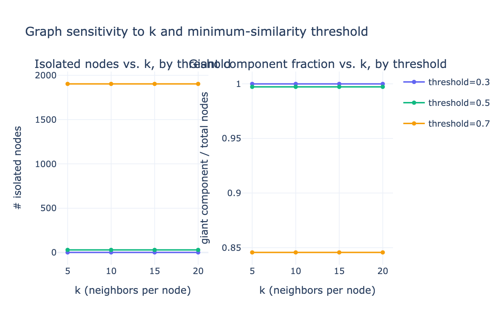
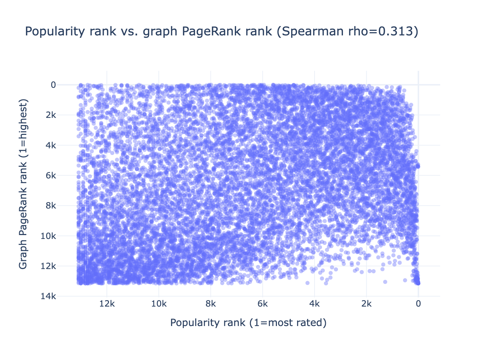

# Week 12 Milestone Report: Graph Analytics and Centrality Report

## Executive Summary

This report covers Week 12: formalizing the item-item graph induced by the MovieLens catalog and
using it for structural analysis. The graph reuses the Week 10 SVD item-factor space (the same
signal behind the `svd_collaborative` recommender), so this is a genuine structural view of an
existing signal, not an unrelated ad hoc graph.

| Metric | Value |
|--------|-------|
| Nodes | 13,176 (movies with ≥50 ratings, i.e. a Week 10 SVD item factor) |
| Edges | 155,331 (undirected, weighted by cosine similarity) |
| Sparsity | 0.179% of all possible pairs |
| Isolated nodes | 29 (0.22%) |
| Connected components | 33 |
| Giant component coverage | 13,139 nodes (**99.72%**) |
| Spearman ρ: popularity vs. graph PageRank | **0.313** |
| Spearman ρ: model rec. in-degree vs. graph PageRank | **0.578** |

The graph is highly connected (one dominant component covering 99.7% of nodes) at the chosen
configuration (`k=15` neighbors, minimum cosine similarity `0.5`). PageRank correlates only weakly
with raw popularity (ρ=0.313), confirming that graph centrality captures something structurally
different from "most-rated" — a small number of niche, low-popularity titles are highly central
because their rating pattern places them in a densely interconnected similarity neighborhood.

---

## 1. Objective

The goal was to formalize the domain as a graph and use it for structural analysis, connecting
back to the Week 10 recommendation layer rather than building an unrelated graph:

> *What does the similarity structure among movies look like as a graph, and does structural
> centrality tell us something different from popularity or model-based ranking?*

Specific questions answered:
- What do nodes and edges mean, and why are they defined this way?
- Is the chosen graph configuration (`k`, similarity threshold) robust, or a hand-picked lucky run?
- Does PageRank on the similarity graph rank movies differently than popularity or the Week 10
  recommender's in-degree?
- What does high centrality mean in this domain, and — just as important — what does it *not* mean?

---

## 2. Inputs and Reproducible Artifacts

### Input artifacts from previous weeks

| Artifact | Source | Purpose |
|----------|--------|---------|
| `week10_svd_item_factors.parquet` | Week 10 | 50-dim item factors used as node features / edge weights |
| `week10_popularity_global.csv` | Week 10 | Popularity ranking for the comparison baseline |
| `week10_svd_recs_top20.parquet` | Week 10 | Recommendation in-degree, the model-based ranking baseline |
| `week07_kmeans_assignments.csv` | Week 7 | Cluster labels attached to graph nodes for the web viewer |
| `movies_catalog.parquet`, `links.csv` | Week 3 | Titles, genres, IMDb/TMDb identifiers |

### Week 12 notebook

| Notebook | Purpose |
|----------|---------|
| [week12_graph_analytics.ipynb](../../notebooks/week12/week12_graph_analytics.ipynb) | Graph construction, sensitivity sweep, centrality, comparison, subgraph export |

### Week 12 output artifacts

| Artifact | Description |
|----------|-------------|
| `week12_graph_meta.json` | Graph definition, chosen configuration, validity-check numbers, correlations |
| `week12_graph_metrics.parquet` | Per-node metrics: degree, weighted degree, PageRank, eigenvector, betweenness, popularity, model in-degree |
| `week12_sensitivity_sweep.csv` / `.html` / `.png` | Sweep over `k` ∈ {5,10,15,20} × threshold ∈ {0.3,0.5,0.7} |
| `week12_popularity_vs_pagerank.html` / `.png` | Scatter of popularity rank vs. graph PageRank rank |
| `movie_graph_viz.json` | Sampled 400-node / 3,334-edge subgraph for the interactive 3D viewer (`web/`) |

---

## 3. Graph Definition

**Node**: a movie with at least 50 ratings in the 25M-rating matrix, i.e. a movie that has a Week 10
SVD item factor (`min_movie_ratings=50` per `week10_svd_meta.json`). Restricting nodes to this set —
rather than all ~62,423 catalog rows — is a deliberate grain choice: movies below the rating floor
have no reliable collaborative signal, so a "similarity" edge to them would be noise, not structure.
This yields **13,176 candidate nodes**.

**Edge**: undirected, weighted. Weight = cosine similarity between two movies' 50-dimensional SVD
item-factor vectors — the same vectors and metric used by the Week 10 `svd_collaborative`
recommender. An edge exists between A and B if B is among A's top-`k` nearest neighbors by cosine
similarity **or** A is among B's top-`k` neighbors (symmetrized), and the similarity clears a
minimum threshold.

**Why undirected**: cosine similarity is symmetric by construction (`sim(A,B) == sim(B,A)`), so a
directed graph would only be justified by an asymmetric relation. That asymmetric relation ("B
appears in A's top-20 recs but not vice versa") is kept as a *separate* ranking signal
(`model_rec_indegree`) for the comparison in Section 6, rather than being conflated with the edge
definition.

**Why weighted and thresholded, not fully dense**: a fully dense weighted graph on 13,176 nodes
(~86.8M possible undirected pairs) would be neither interpretable nor visualizable, and most pairs
have near-zero similarity. Keeping only the top-`k` neighbors per node above a minimum similarity
controls sparsity and keeps only edges that plausibly reflect a real co-rating relationship. Both
`k` and the threshold are swept in Section 4 rather than chosen by hand.

---

## 4. Graph Construction and Sensitivity Sweep

Edges are built with `sklearn.neighbors.NearestNeighbors` (`metric='cosine'`, brute force), which
computes each node's `k` nearest neighbors without materializing the full 13,176 × 13,176 similarity
matrix, then symmetrizes and drops pairs below the minimum similarity.

`k` and the minimum-similarity threshold were swept jointly to check whether the graph's structure
is sensitive to the choice, rather than reporting one hand-picked, unexamined configuration:

| k | min. similarity | Edges | Sparsity | Isolated | Components | Giant component | Giant frac. |
|---|---|---|---|---|---|---|---|
| 5  | 0.3 | 54,494  | 0.063% | 1     | 2    | 13,175 | 99.99% |
| 5  | 0.5 | 54,036  | 0.062% | 29    | 33   | 13,139 | 99.72% |
| 5  | 0.7 | 41,172  | 0.047% | 1,903 | 1,957 | 11,142 | 84.56% |
| 10 | 0.3 | 107,115 | 0.123% | 1     | 2    | 13,175 | 99.99% |
| 10 | 0.5 | 105,447 | 0.121% | 29    | 33   | 13,139 | 99.72% |
| 10 | 0.7 | 74,813  | 0.086% | 1,903 | 1,957 | 11,142 | 84.56% |
| **15** | **0.5** | **155,331** | **0.179%** | **29** | **33** | **13,139** | **99.72%** |
| 15 | 0.3 | 158,911 | 0.183% | 1     | 2    | 13,175 | 99.99% |
| 15 | 0.7 | 104,760 | 0.121% | 1,903 | 1,957 | 11,142 | 84.56% |
| 20 | 0.3 | 210,185 | 0.242% | 1     | 2    | 13,175 | 99.99% |
| 20 | 0.5 | 203,980 | 0.235% | 29    | 33   | 13,139 | 99.72% |
| 20 | 0.7 | 132,124 | 0.152% | 1,903 | 1,957 | 11,142 | 84.56% |

> Source: `artifacts/week12/week12_sensitivity_sweep.csv`.

**Key observation**: for a fixed threshold, the isolated-node count is *constant* across all values
of `k` (1 at threshold=0.3, 29 at threshold=0.5, 1,903 at threshold=0.7). This is because isolation
is driven by whether a node's single closest neighbor clears the threshold at all — if the top-1
neighbor's similarity already falls below the threshold, looking at more neighbors (`k`) cannot
produce a qualifying edge. The threshold, not `k`, controls connectivity; `k` mainly controls how
many *additional* edges accumulate once a node is already connected.

---

## 5. Chosen Configuration and Validity Checks

`threshold=0.7` strands 1,903 nodes (14.4%) even at `k=20` — too strict, since most real co-rating
similarity signal in this 50-dimensional space falls below 0.7. `threshold=0.3` is already
near-fully-connected at `k=10` (99.99% giant component, only 1 isolated node) — too permissive,
approaching a near-complete graph and defeating the purpose of a sparse structural graph.

**Chosen configuration: `k=15`, `min_similarity=0.5`.** This keeps the giant component covering the
large majority of nodes (99.72%) while still discarding most low-similarity pairs (sparsity 0.179%),
and matches how the Week 10 `content_cosine` / `svd_collaborative` recommenders already treat
similarity — same latent space, same metric.

Validity checks at the chosen configuration:

| Check | Result |
|-------|--------|
| Edge sparsity | 0.179% of all possible undirected pairs — sparse by design |
| Isolated nodes | 29 / 13,176 (0.22%) |
| Connected components | 33 (one giant component + 32 small fragments) |
| Giant component coverage | 13,139 / 13,176 nodes (99.72%) |
| Sensitivity | See Section 4 — connectivity is threshold-driven, not an artifact of one lucky `k` |

---

## 6. Centrality Measures

Degree, weighted degree, and PageRank are computed on the full graph. Eigenvector centrality is
undefined on disconnected graphs (`networkx` raises `AmbiguousSolution`), so it is computed on the
giant connected component only, with 0 assigned to the 37 nodes outside it — those nodes have no
path into the component's dominant eigenvector by construction, so 0 is the correct value, not a
missing one. Exact betweenness centrality is `O(V·E)` and infeasible at this scale (13,176 nodes,
155,331 edges); an approximate betweenness is computed instead using a random sample of 500 source
nodes (`networkx`'s native `k` parameter), with edge distance defined as `1 − similarity`.

### Top 10 movies by PageRank

| Movie | PageRank | Degree | Weighted degree | Popularity rank | Model-recs rank |
|-------|---------:|-------:|-----------------:|-----------------:|-----------------:|
| L'Atalante (1934) | 0.000265 | 107 | 100.32 | 6,351 | 3,855 |
| The Lazarus Effect (2015) | 0.000261 | 96 | 85.01 | 7,985 | 5,182 |
| Viridiana (1961) | 0.000247 | 101 | 95.56 | 5,592 | 916 |
| Day of Wrath (1943) | 0.000237 | 94 | 88.33 | 8,052 | 3,535 |
| Perfect Stranger (2007) | 0.000230 | 82 | 68.94 | 6,044 | 1,160 |
| Untraceable (2008) | 0.000228 | 81 | 66.64 | 5,594 | 2,035 |
| The Reaping (2007) | 0.000226 | 82 | 70.13 | 5,950 | 2,693 |
| Pickpocket (1959) | 0.000223 | 90 | 84.13 | 6,120 | 1,033 |
| I Know Who Killed Me (2007) | 0.000223 | 79 | 70.20 | 7,632 | 5,576 |
| Devil's Knot (2013) | 0.000217 | 77 | 61.85 | 10,766 | 6,029 |

> Source: `artifacts/week12/week12_graph_metrics.parquet` (`rank_popularity` / `rank_model_recindegree`: 1 = most popular / most-recommended; out of 13,176).

**Key finding**: none of the top-10 PageRank movies rank in the popularity top-1,000 — the highest
is L'Atalante at popularity rank 6,351 out of 13,176 (bottom half of the catalog). High PageRank
here means a movie sits in a densely-interconnected neighborhood of the similarity structure
(reachable through many strong-similarity chains), which is a structurally different property from
being widely rated.

---

## 7. Comparison: Graph Ranking vs. Popularity vs. Model-Based Ranking

Three independent rankings over the same 13,176-node set:

- **Popularity ranking**: rank by `rating_count` (Week 10 `week10_popularity_global.csv`) —
  "how many people rated this."
- **Model-based ranking**: rank by *recommendation in-degree* — how many times a movie appears
  inside another movie's Week 10 SVD top-20 recommendation list. This is a directed, model-derived
  signal distinct from the graph's undirected similarity edges.
- **Graph ranking**: rank by PageRank on the Week 12 similarity graph.

| Comparison | Spearman ρ |
|------------|-----------:|
| Popularity vs. graph PageRank | **0.313** |
| Model rec. in-degree vs. graph PageRank | **0.578** |
| Popularity vs. model rec. in-degree | 0.785 |

Popularity and the model's recommendation in-degree are strongly correlated (ρ=0.785) — both are,
in different ways, proxies for how mainstream a movie is. Graph PageRank correlates much more
weakly with popularity (ρ=0.313) and moderately with model in-degree (ρ=0.578): the similarity
graph surfaces a partially different signal — structural embeddedness in the SVD similarity space —
that is only loosely tied to how many people rated a movie.

---

## 8. Interpretation Note: What Graph Structure Means, and Does Not Mean

**What it means**: an edge between two movies indicates that, in the space learned by the Week 10
SVD factorization of the user-rating matrix, the two movies have highly correlated rating patterns
across the user base — people who rate one in a particular direction tend to rate the other
similarly. High PageRank means a movie sits in a densely-interconnected neighborhood of this
similarity structure: not just similar to a few movies, but reachable through many short chains of
strong similarity.

**What it does not mean**:
- It is **not** a claim about shared plot, cast, or genre — the graph is built purely from rating
  co-occurrence, not content features. Two movies can be structurally central neighbors while
  sharing no genre tag.
- High PageRank is **not** the same as "popular" — ρ=0.313 is positive but far from 1: the graph
  surfaces movies that are structurally embedded in the similarity space without necessarily being
  the most-rated movies overall, and vice versa.
- The graph is **not directed** and does not encode "recommend A because of B" — that asymmetric
  signal is captured separately by the Week 10 recommendation lists (`model_rec_indegree`) used for
  comparison above.
- The similarity signal inherits whatever rating biases exist in MovieLens (predominantly
  English-language, enthusiast-skewed userbase); it should not be read as a universal notion of
  movie similarity.
- Isolated nodes and small disconnected components are not "unrelated" movies in general — they are
  movies whose rating pattern did not clear the chosen similarity threshold against any node's
  top-15 neighbors, which can also reflect a small or unusual rater population for that title.

---

## 9. Subgraph Sampling for the 3D Web Visualization

Drawing all 13,176 nodes in a browser-based 3D scene is neither readable nor performant, so a
**connected** subgraph of 400 nodes was sampled for the interactive viewer (`web/`) using
hub-expansion sampling: start from the 40 highest-PageRank nodes in the giant component (structural
hubs), then greedily grow the sample by always adding the unselected node with the strongest edge
weight to an already-selected node. Because every added node is attached by construction, the
sampled subgraph has **no isolated nodes**, unlike a uniform-random node sample with an
induced-edge cut, which typically strands many isolated points.

| | Full graph | Sampled subgraph |
|---|---:|---:|
| Nodes | 13,176 | 400 |
| Edges | 155,331 | 3,334 |
| Isolated nodes | 29 | 0 (by construction) |

The sampled subgraph is exported to `artifacts/week12/movie_graph_viz.json` and copied to
`web/public/movie_graph.json`, where node metadata (title, genres, IMDb/TMDb links, PageRank,
degree, cluster ID) drives the interactive viewer. Poster URLs are filled in separately by
`scripts/fetch_posters.py` via the TMDb API, for exactly this sampled set of movies.

---

## 10. What Worked and What Did Not

### What worked

- Reusing the Week 10 SVD item-factor space as the graph's edge weight keeps the graph analysis
  connected to an existing, already-validated signal instead of introducing an unrelated ad hoc
  similarity metric.
- The sensitivity sweep cleanly separates the role of `k` (marginal edge accumulation) from the
  role of the similarity threshold (connectivity), which made the configuration choice defensible
  rather than arbitrary.
- Hub-expansion sampling produced a fully connected, hub-anchored 400-node subgraph suitable for a
  real-time 3D viewer, with zero isolated nodes.

### What did not work

- **Eigenvector centrality** is undefined outside the giant component; 37 nodes necessarily receive
  a 0 that reflects "no path into the dominant eigenvector," not "zero centrality" in an absolute
  sense — this distinction has to be stated explicitly or it reads as a missing value.
- **Betweenness centrality** could not be computed exactly at this scale (13,176 nodes, 155,331
  edges); the 500-source approximation trades precision for tractability and should not be read as
  an exact ranking.
- **Weak correlation with popularity** (ρ=0.313) means graph PageRank alone is a poor stand-in for
  "movies most people already know" — it answers a different question (structural embeddedness),
  not "what should the homepage show a new user."

---

## 11. Ethics and Access Note

- **Data source**: GroupLens MovieLens 25M public release (research license).
- **Access**: Educational and research use only; raw data not redistributed.
- **Personal data risk**: all user identifiers are anonymized integer IDs in the source dataset.
- **Mitigation**: the graph is built entirely at the movie level from aggregate SVD item factors;
  no individual user rating history or user identifier is exposed by any node, edge, or centrality
  score in this analysis.

---

## 12. Reproducibility

Run the notebook after the Week 10 artifacts exist:

1. `notebooks/week12/week12_graph_analytics.ipynb`

Then, to refresh the web viewer's data:

2. `python scripts/fetch_posters.py` — populates `posterUrl` for the ~400 sampled movies via the
   TMDb API.
3. Copy `artifacts/week12/movie_graph_viz.json` to `web/public/movie_graph.json`.

All outputs are saved to `artifacts/week12/`.

**Key parameters for reproducibility:**

| Parameter | Value |
|-----------|-------|
| Node definition | Movie with ≥50 ratings (has a Week 10 SVD item factor) |
| Candidate nodes | 13,176 |
| Similarity metric | Cosine, on 50-dim Week 10 SVD item factors |
| Chosen k (neighbors per node) | 15 |
| Chosen minimum similarity | 0.5 |
| Betweenness sample size | 500 |
| Subgraph sample size (web viewer) | 400 nodes / 3,334 edges |
| Hub seeds for sampling | 40 (highest PageRank in giant component) |
| Random state | 42 |

---

## 13. Conclusion

Week 12 is complete. A 13,176-node, 155,331-edge item-item similarity graph was built directly from
the Week 10 SVD item-factor space, validated with a joint sensitivity sweep over `k` and similarity
threshold, and analyzed with degree, weighted degree, PageRank, eigenvector, and approximate
betweenness centrality.

- The chosen configuration (`k=15`, `min_similarity=0.5`) yields a giant component covering 99.72%
  of nodes, and the sweep shows this connectivity is driven by the threshold, not a lucky choice
  of `k`.
- Graph PageRank correlates only weakly with popularity (ρ=0.313) and moderately with the Week 10
  model's recommendation in-degree (ρ=0.578): structural centrality in the similarity graph is a
  genuinely different signal from "most-rated" or "most-recommended," not a relabeling of either.
- The interpretation note makes explicit what the graph does and does not license: it reflects
  rating co-occurrence, not content similarity; it is undirected and does not encode asymmetric
  recommendation; and it inherits MovieLens's own rating-population biases.
- A connected, hub-anchored 400-node subgraph was sampled and exported to drive the interactive 3D
  MovieLens Discovery viewer (`web/`), completing the pipeline from raw ratings through
  representation, clustering, recommendation, and now graph structure.
